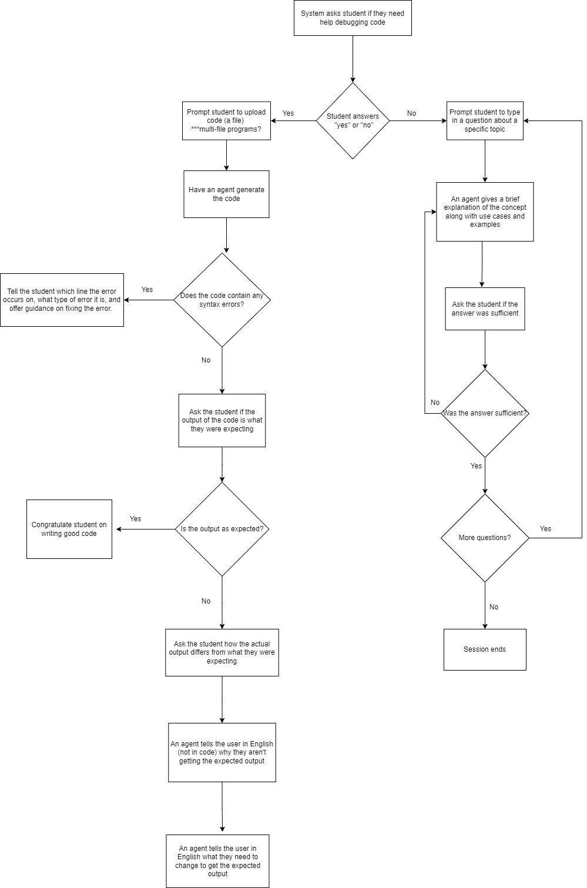

# VITA Team Portal

## Summer 2024 Preparation
We'll be doing development with 8 weeks of sprints over the summer term -- we'll use this page as a central organizational tool.

step 1: customgpt basic
step 2: autogen with openai basic api (set up FTCC organizations)
step 3: add litellm for claude integration

Reminder of VITA functionality
1. "Please help" - identifies syntax and semantic errors and suggests next steps in English (debugging) 
2. "Explain this code" (similar to replit's "AI -> Explain this Code" feature)
3. "Explain this concept" (e.g. "I don't understand loops") which doesn't execute code,
    instead generate example code with use cases (this is the only time the system should
    be writing code)

- Existing Autogen Demo
  - refresh API keys (expired)
  - test to confirm we still have the functionality from Spring
    - test different models, workflows for quality of outputs
    - todo: run with local models, claude (uses LiteLLM wrapper)
  - (MM) goal: spin up a working Autogen in a codespace, use RAG
  - (currently the RAG is not implemented)
- Quick & Dirty CustomGPT Demo
  - refresh the basic OpenAI "Custom GPT" agent demo with some relevant RAG info
  - confirm basic functionality
  - (we don't need this one to properly avoid giving the full answer, just the basics)
- Documentation of the work done so far
- Scope of Work for Summer
  - properly Agile up the process with sprints and user stories that then have requirements with estimates
 
## Known Issues
- code that is correct as input causes the system to introduce errors
  - using multiple agents would be a possible fix
  - remember, we're going to move away from groupchat and have multiple specialized agents anyway

## Preparation for Fall
- fork base version for math/english
- look at GEIAC rubric and example essays

## Artifacts
requirements.txt (TBD)

raw developer notes (<a href="devnotes.html">here</a>)

preliminary flowchart
</img>
